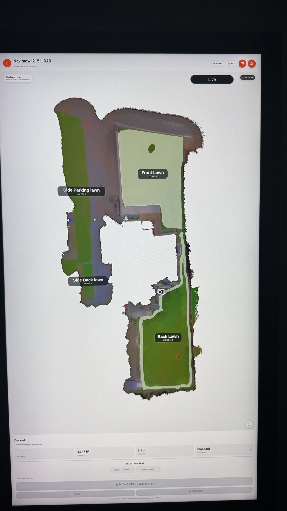
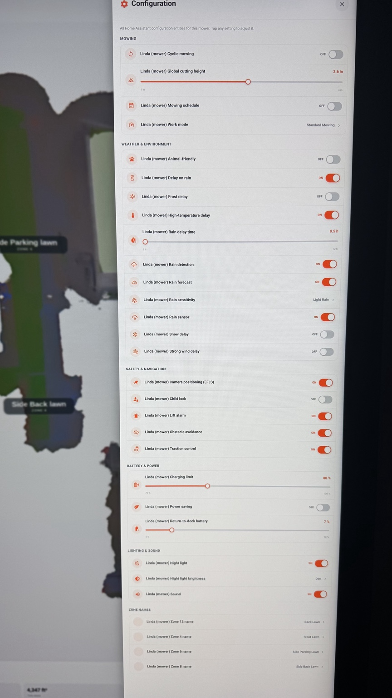
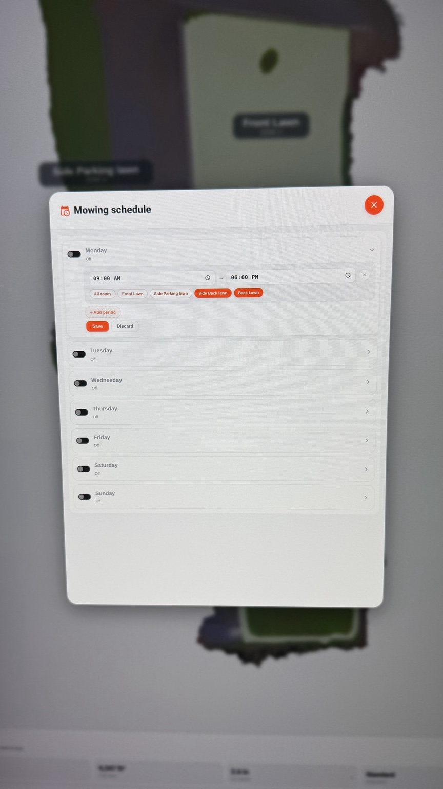
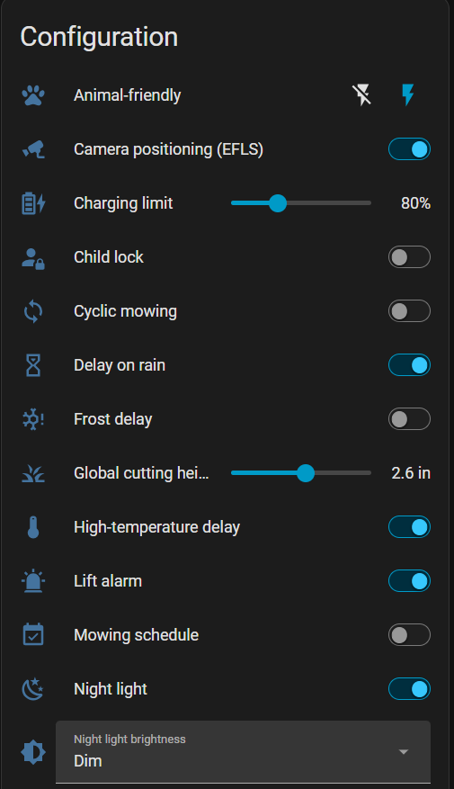
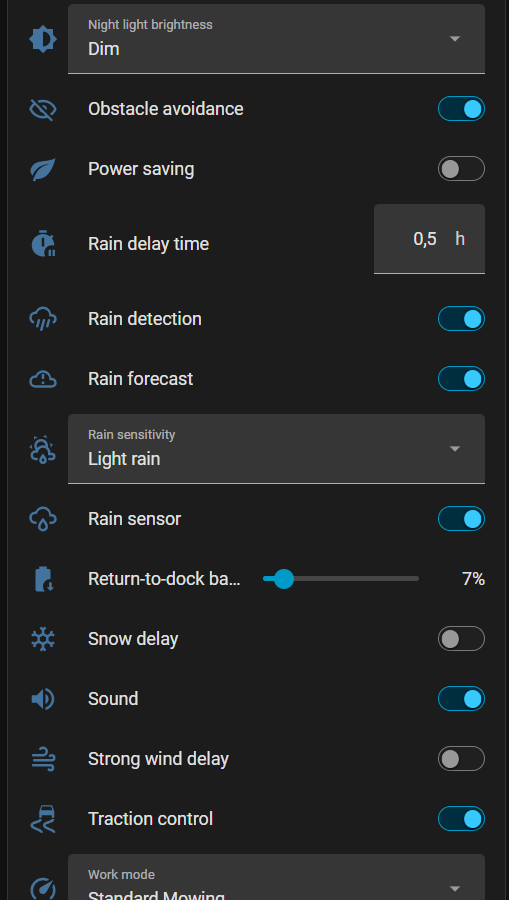
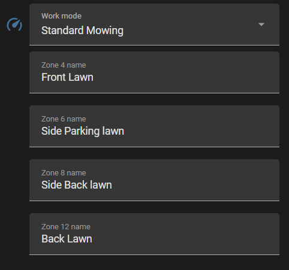
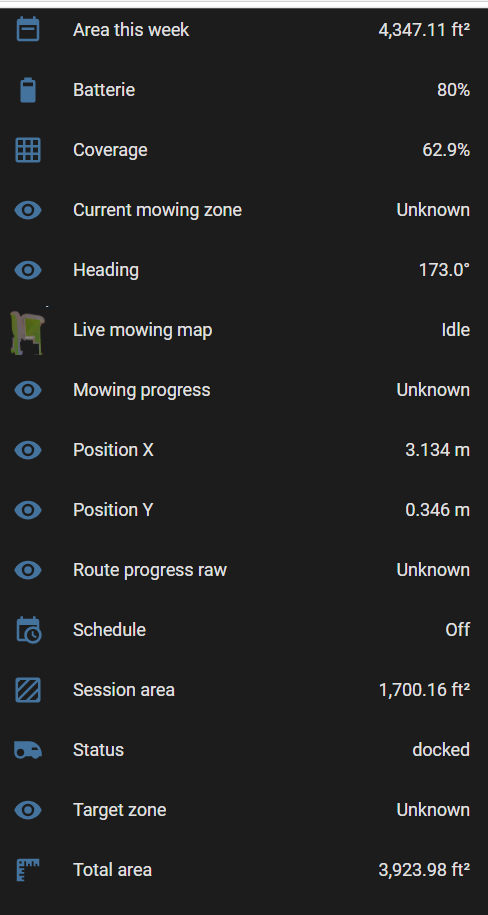
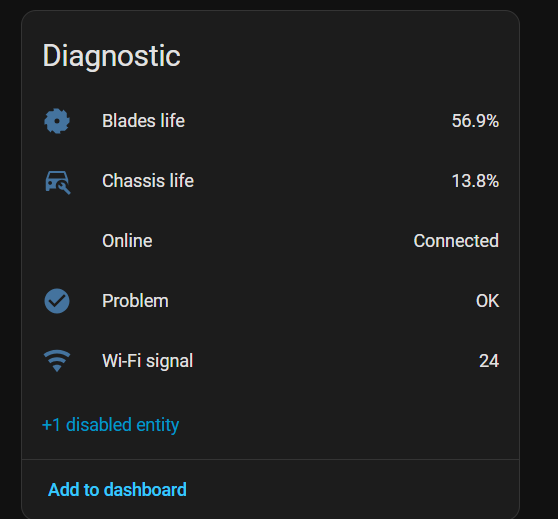

# Navimow HA Pro

**Public beta — unofficial Home Assistant integration for Segway Navimow robotic mowers.**

Navimow HA Pro brings mower telemetry, controls, LiDAR map data, live position, zone
mowing, schedules and a responsive Navimow-style dashboard into Home Assistant.

> [!WARNING]
> This project is unofficial and is not affiliated with, endorsed by, or supported by
> Segway or Navimow. It uses unofficial/private cloud interfaces that can change without
> notice. Use the beta at your own risk and keep the official Navimow app available.

### Resume or start fresh

When a selected mowing zone already has partial work recorded, the dashboard offers **Resume work** or **Start fresh**. Resume preserves the server-side coverage and continues the remaining uncut area. Start fresh clears the previous session trail/progress and begins a new mowing session. If the mower is manually returned to the charging base before the job is complete, the unfinished last-commanded zone selection is restored so the same Resume / Start fresh choice is available.

## Current beta focus

The current development/test baseline is the **Navimow i-series LiDAR family**. The
integration may work with additional Navimow models, but public beta feedback is needed
before broader compatibility is claimed.

## Features
- **Official swept-path trail (experimental):** downloads the same per-zone path dataset used by the Navimow app and overlays it on the Home Assistant live map.

- Home Assistant config flow for Navimow account setup
- Mower status, battery, progress and weekly mowing area
- Live LiDAR map camera with mower position
- Fast position bootstrap when mowing starts
- Friendly editable zone names
- Select one or multiple zones and mow them in order
- Fresh-session/reset behavior for selected-zone jobs
- Live mowing trail that excludes travel-to-zone and return-home movement
- Perimeter trail tolerance for edge mowing near/outside the zone polygon
- Dock-position correction when the mower reports Docked/Charging
- Cutting-height control
- Precision / Standard / Efficient work modes
- Responsive Navimow-style dashboard for kiosk, desktop, tablet and phone
- Fullscreen map mode for easier zone selection on smaller displays
- Configuration panel with inline switches and sliders
- Native Navimow schedule editor with multiple periods and zone selection
- Rain / wind / frost / snow / temperature-delay handling and visual alerts
- Manual Pause and Return Home controls
- Local integration branding for Home Assistant 2026.3+

## Main dashboard

The responsive dashboard keeps the live LiDAR map, mower position, zones, progress,
cutting height, work mode and mowing controls together on one screen.



## Installation with HACS

Until the repository is accepted into the default HACS catalog:

1. In HACS, open **Custom repositories**.
2. Add this GitHub repository URL.
3. Select **Integration** as the category.
4. Install **Navimow HA Pro**.
5. Restart Home Assistant.
6. Go to **Settings → Devices & services → Add integration** and search for
   **Navimow HA Pro**.

For public beta releases, install the newest beta release when HACS offers it.

## Manual installation

Copy:

```text
custom_components/navimow_ha_pro/
```

to:

```text
/config/custom_components/navimow_ha_pro/
```

Restart Home Assistant and add the integration from **Settings → Devices & services**.

## Dashboard card installation

Navimow HA Pro includes a custom Lovelace card named
`navimow-zone-dashboard-card`. The card provides the interactive LiDAR map, zone
selection, mowing controls, schedules, settings, alerts and responsive phone/tablet/kiosk
layout.

### JavaScript card interface

The bundled card includes a complete configuration drawer and a native schedule editor
without requiring separate Lovelace cards.

| Configuration drawer | Mowing schedule |
| --- | --- |
|  |  |

### Recommended installation (HACS)

1. Install **Navimow HA Pro** from HACS and restart Home Assistant.
2. Go to **Settings → Devices & services → Add integration** and configure
   **Navimow HA Pro**.
3. Wait for the mower entities and map camera to appear.
4. The integration will attempt to copy and register its bundled dashboard JavaScript
   automatically when Home Assistant starts.
5. Create a new dashboard, or add a new view to an existing dashboard.
6. Open the dashboard's **Raw configuration editor** and add the example below.

```yaml
views:
  - type: panel
    path: navimow
    title: Navimow
    icon: mdi:robot-mower
    cards:
      - type: custom:navimow-zone-dashboard-card
```

No mower entity IDs are required in the card YAML. The card discovers the entities
created by Navimow HA Pro for the configured mower.

### Creating a dedicated Navimow dashboard

A dedicated panel dashboard gives the card the most screen space. In Home Assistant:

1. Open **Settings → Dashboards**.
2. Select **Add dashboard**.
3. Give it a name such as **Navimow** and create it.
4. Open the new dashboard and enter edit mode.
5. Open the three-dot menu and choose **Raw configuration editor**.
6. Replace the example view with the YAML shown above and save.

If the dashboard URL is `dashboard-navimow` and the view path is `navimow`, the page is
normally available at:

```text
/dashboard-navimow/navimow
```

### Manual card resource setup / troubleshooting

If Home Assistant displays:

```text
Custom element doesn't exist: navimow-zone-dashboard-card
```

the frontend resource did not load. Verify that the bundled card has been copied to:

```text
/config/www/navimow_ha_pro/navimow-zone-dashboard-card.js
```

Home Assistant exposes files in `/config/www/` under the `/local/` browser path.
Therefore the card resource URL is:

```text
/local/navimow_ha_pro/navimow-zone-dashboard-card.js
```

Then register it manually:

1. Open **Settings → Dashboards**.
2. Open the three-dot menu in the upper-right corner and choose **Resources**.
3. Select **Add resource**.
4. Enter `/local/navimow_ha_pro/navimow-zone-dashboard-card.js`.
5. Select **JavaScript module** as the resource type.
6. Save, then refresh Home Assistant.

If **Resources** is not shown, enable **Advanced mode** in your Home Assistant user
profile. Home Assistant requires custom-card JavaScript to be accessible to the frontend
and registered as a module resource.

After installing or updating the card, a browser may still have the old JavaScript
cached. Try a hard refresh (`Ctrl+F5` on Windows/Linux), completely close/reopen the
Home Assistant mobile app or browser tab, or restart Home Assistant if the card still
does not load.

### Phone, tablet and kiosk use

The dashboard is responsive and is intended for portrait kiosks, desktop/laptop
browsers, tablets and phones. On smaller displays, use the **fullscreen map** button to
maximize the LiDAR map while selecting zones. The normal dashboard remains optimized
for larger touch displays where the map and mower controls can stay visible together.

### Optional navigation button

If you use another Home Assistant dashboard as your main screen, you can navigate to
the Navimow dashboard from a button. For example, with `custom:button-card`:

```yaml
type: custom:button-card
icon: mdi:robot-mower
show_name: false
tap_action:
  action: navigate
  navigation_path: /dashboard-navimow/navimow
```

`custom:button-card` is optional and is not required by Navimow HA Pro.

## Home Assistant entities

### Configuration

Configuration entities expose mower behavior, weather protection, safety controls,
battery settings, lighting, sound, work mode and editable zone names directly in Home
Assistant.

| Configuration | Weather and navigation | Work mode and zone names |
| --- | --- | --- |
|  |  |  |

### Sensors

Sensor entities provide live state, battery, coverage, mowing areas, active-zone,
position, heading, progress and schedule information.



### Diagnostics

Diagnostic entities expose connectivity, problem state, Wi-Fi signal and service-life
information for the blades and chassis.



## Services

The integration includes Home Assistant services for advanced operations, including:

- `navimow_ha_pro.mow` — start one or more selected zone IDs in order
- `navimow_ha_pro.set_schedule` — save a weekday's mowing periods/zones
- `navimow_ha_pro.set_zone_name` — assign friendly names to Navimow partition IDs

The dashboard normally calls these for you.

## Support the project


If you enjoy Navimow HA Pro and would like to support the work behind it, donations are
appreciated but never required.

- **PayPal:** [paypal.me/EricAllard101](https://paypal.me/EricAllard101)
- **Bitcoin (BTC):** `bc1qtrd4u4vvcvpgt4fnaz3emkydsn3y3y7w8mejz5`
- **Ethereum (Ethereum network):** `0x8234c7edf30f26e1ffd0a778ef2d37c987f52fdd`
- **BNB (BNB Smart Chain / BEP-20):** `0x8234c7edf30f26e1ffd0a778ef2d37c987f52fdd`

Please verify the address and selected network before sending cryptocurrency. Donations
are voluntary and do not purchase support, warranties or additional features.

## Privacy and diagnostics

Do **not** publish Navimow passwords, OAuth/private tokens, MQTT credentials, mower
serial numbers, precise GPS coordinates, or unredacted diagnostics/logs.

The account password is used by the private-map setup path to obtain renewable tokens;
the integration UI states that the password itself is not stored.

## Known beta limitations

- Private Navimow endpoints/protocols can change at any time.
- Model compatibility outside the current i-series LiDAR test baseline is not yet
  established.
- Cloud state acknowledgement can take several seconds even though the dashboard uses
  optimistic controls to keep the UI responsive.
- Location/map freshness ultimately depends on data Navimow makes available to the
  account and mower.
- Local brand images require Home Assistant 2026.3 or newer; older HA versions can still
  run the integration but may show a generic integration icon.

## Reporting bugs

Use the GitHub issue templates and include Home Assistant version, mower model,
integration version, reproduction steps and **redacted** logs. Model-compatibility reports
are especially useful during the beta.

## License

MIT. See [LICENSE](LICENSE).

## Trademark notice

Segway and Navimow names/logos are trademarks of their respective owners. They are used
here only to identify compatibility with the relevant products. This project is not an
official Segway/Navimow product.

## Credits

Navimow HA Pro is based on the MIT-licensed `ilguala/navimow_pro` Home Assistant
integration by Roberto Gualandris and includes substantial dashboard, LiDAR-map,
configuration, scheduling, live-position and trail work developed on top of that base.
The original MIT copyright notice is preserved in this repository's license.
